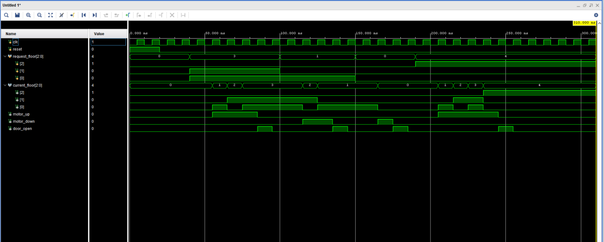
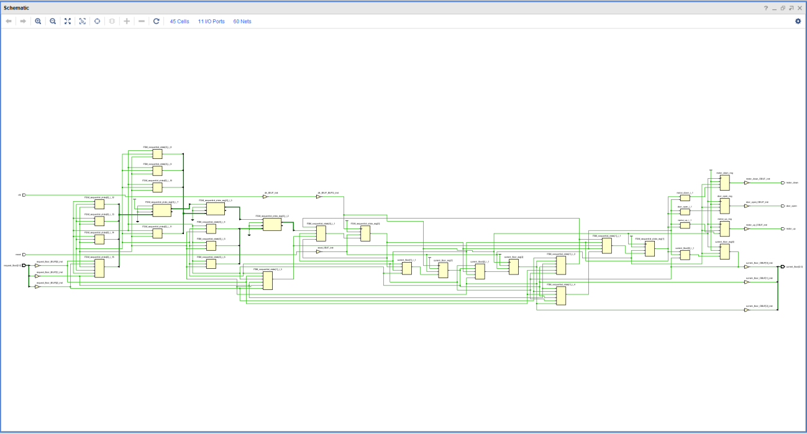

# FSM-Based Elevator Controller using Verilog HDL

## 📌 Project Overview

This project implements a Finite State Machine (FSM)-based Elevator Controller using Verilog HDL.

The controller compares the requested floor with the current floor and controls the elevator movement accordingly.

This project was developed as part of my **Skillentrix Internship**.

## 🎯 Objectives

- Design an FSM-based elevator controller
- Implement the controller using Verilog HDL
- Develop a testbench for functional verification
- Simulate the design and analyze the waveform
- Generate the RTL schematic using Vivado

## ⚙️ FSM States

The controller consists of four states:

- IDLE
- MOVE_UP
- MOVE_DOWN
- OPEN_DOOR

## 🔧 Technologies Used

- Verilog HDL
- ModelSim
- Xilinx Vivado
- RTL Design
- Finite State Machine (FSM)

## 📂 Project Files

| File | Description |
|---|---|
| `elevator_controller.v` | Main elevator controller design |
| `tb_elevator_controller.v` | Verilog testbench |
| `elevator_waveform.png` | Simulation waveform |
| `rtl_schematic.png` | RTL schematic |

## 🧪 Verification

The testbench generates a 10 ns clock and tests different floor requests including floors 3, 1, 0 and 4.

## 📊 Simulation Waveform

## 🖥️ RTL Schematic

## 🎓 Internship

**Skillentrix_Intern**

Project: FSM-Based Elevator Controller using Verilog HDL

## 👨‍💻 Author

Athul Krishna T O
